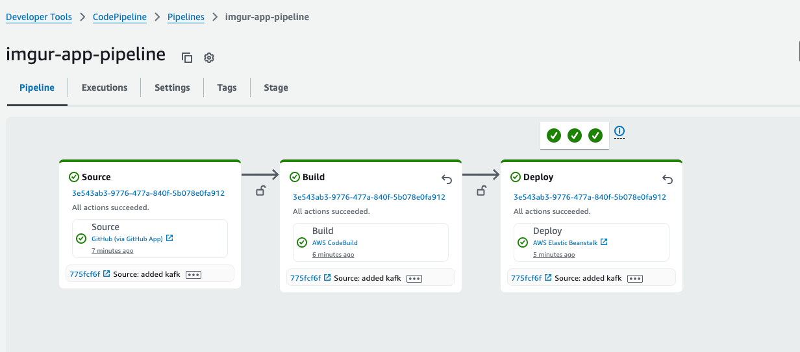

# imgur-app
Developer: Balakumaran Sugumar  
Date: 04/17/2025

GitHub Link: https://github.com/balakumaran-sugumar/imgur-app  
elasticBeanStalk URL: http://imgur-dev.eba-prfmpc3c.us-east-1.elasticbeanstalk.com:8080/

### User Flow interaction

- User needs to register using: http://localhost:8080/api/users/register
- Once registered, image can be uploaded here: (POST) http://localhost:8080/api/media/upload
- Can view the images uploaded using: (GET) http://localhost:8080/api/media
- Can download images: (GET) http://localhost:8080/api/media/download/1
- Can Delete the image: (DELETE) http://localhost:8080/api/media/2

### Some of key Consideration for this implementation

#### **The code is managed in AWS** and is deployed using AWSCodeBuild and AWSPipeline to deploy to elasticbeanstalk

- The Code deployment is controlled by **Webhooks on while merging** from develop to main in github. App is deployed as elasticBeanStalk: http://imgur-dev.eba-prfmpc3c.us-east-1.elasticbeanstalk.com:8080/
- This is not a secured URL and has been considered for this implementation.
- Service will be decommissioned post demo.

#### Code Uses Caffiene Cache
- The implementation uses local cache for faster retrieval of data to handle large volume of traffic, serving as a intermediate cache between the database

#### Code Uses Kafka Implementation
- The code implements kafka to publish and retrieve data from local cluster.
- Test cases are written using embedded kafka.

### Unit test coverage
Total: 28 test-cases, with statement coverage of 85%

### Few Challenges
* OAuth2 integration - provisioning a independent OAuth server
* Frequency of Imgur returning 429 TOO MANY REQUEST and 503 Service Unavailable was high
